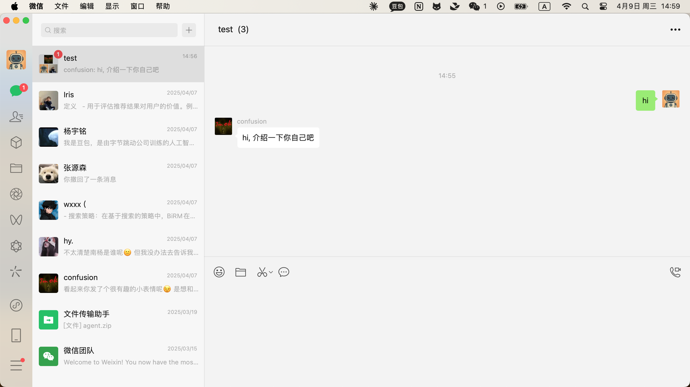
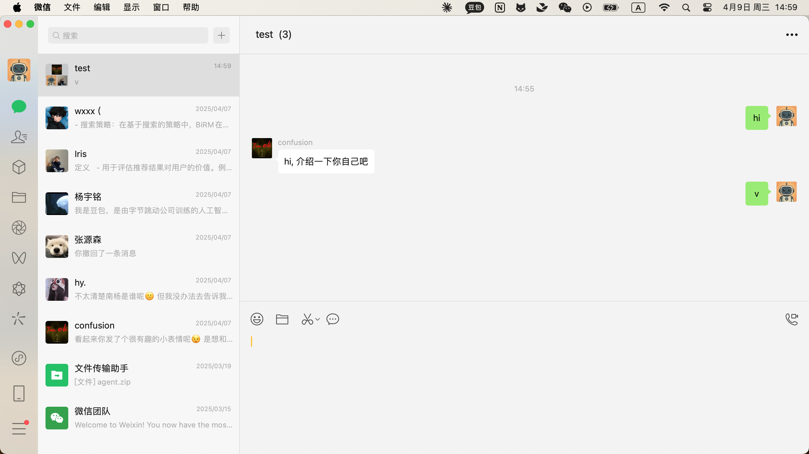

### 2025-04-09 14:59:57

**Screenshot:**

**Output:**
I get the high quality answer and I will send it.
Action: send text: 我是豆包呀，能陪你谈天说地，解答各种问题，无论是科学知识、历史文化、生活常识，还是帮你出谋划策、创作故事等等，都可以来找我交流探讨呢。 

### 2025-04-09 15:00:03

**Screenshot:**

**Output:**
Thought: The user's message "hi, 介绍一下你自己吧" has already been processed and responded to. There are no new messages from the user after this response.
Action: finish

