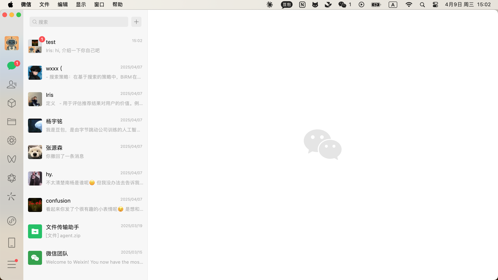

### 2025-04-09 15:02:45

**Screenshot:**

**Output:**
Thought: I need to extract the recent user messages that appear after the last green box and compile them into a single query.
Action: Extract the message "hi, 介绍一下你自己吧" from the white box and prepare it for compilation.

### 2025-04-09 15:02:51

**Screenshot:**

**Output:**
I get the high quality answer and I will send it.
Action: send text: 我是豆包呀，能陪你谈天说地，解答各种问题，无论是科学知识、历史文化、生活常识，还是情感困惑、学习技巧等等，都可以和我交流探讨，随时为你提供准确有用的信息和有趣的观点呢。 

### 2025-04-09 15:02:55

**Screenshot:**

**Output:**
Thought: The task of responding to the user's message has been completed, and there are no additional unread messages after the last green box.
Action: finish

