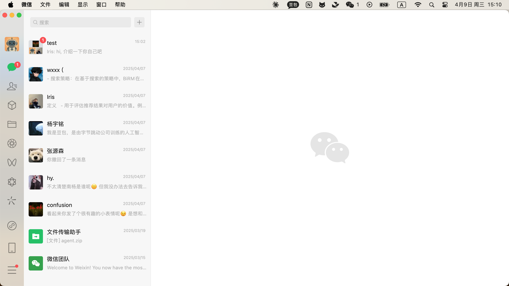

### 2025-04-09 15:10:50

**Screenshot:**

**Output:**
Thought: I need to extract the recent user messages that appear after the last green box and compile them into a single query.
Action: Extract the message "hi, 介绍一下你自己吧" from the white box under the contact named "test" and prepare it for compilation.

