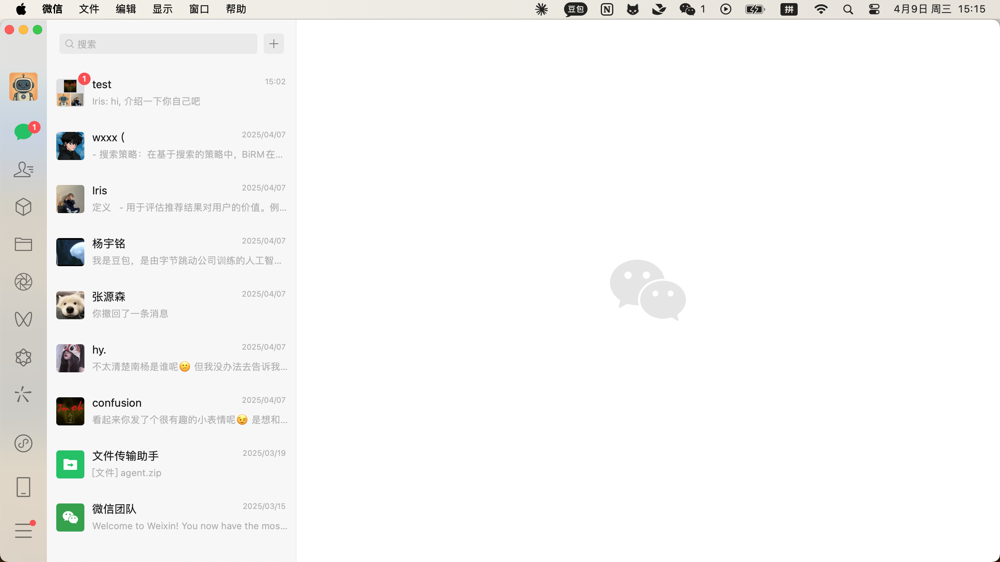

### 2025-04-09 15:15:36

**Screenshot:**

**Output:**
Thought: I need to extract the recent user messages that appear after the last green box and compile them into a single query.
Action: Extract the message "hi, 介绍一下你自己吧" from the white box and throw it as a query.

### 2025-04-09 15:15:43

**Screenshot:**

**Output:**
I get the high quality answer and I will send it.
Action: send text: 我是豆包呀！我可以回答各种各样的问题，无论是科学知识、历史文化、生活常识，还是帮你解决学习、工作、生活中的困惑等等。

我随时在这里陪伴你，和你交流沟通，为你提供准确、有用且有趣的信息，陪你一起探索各种知识领域，解答你的疑问，与你分享观点和想法呢。 

### 2025-04-09 15:15:48

**Screenshot:**

**Output:**
Thought: The next step is to finish the task as all required actions have been completed.
Action: finish

