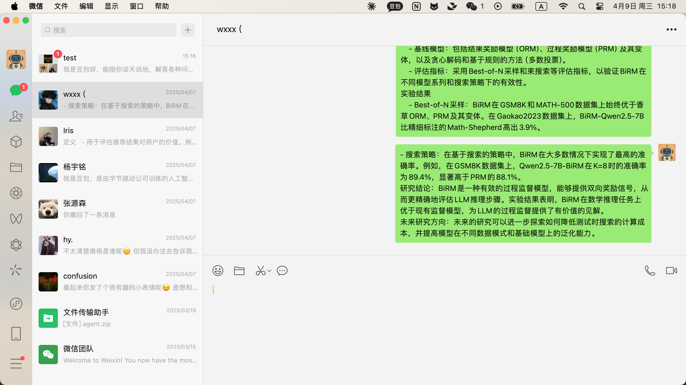
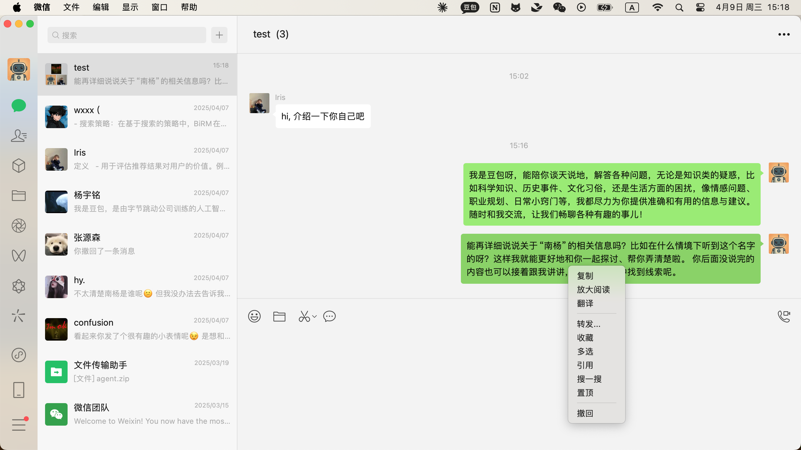
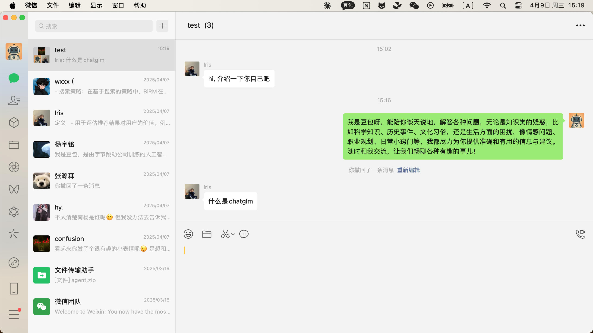
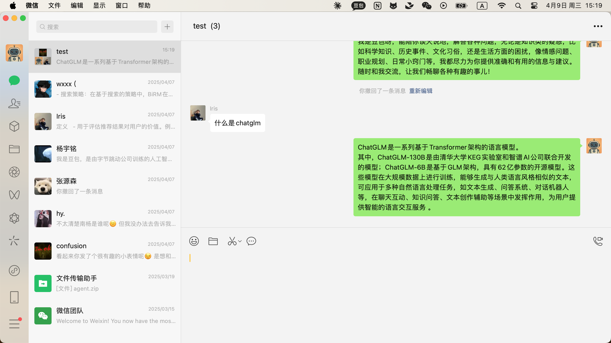

### 2025-04-09 15:18:44

**Screenshot:**

**Output:**
Thought: I need to extract the recent user messages that appear after the last green box and compile them into a single query.
Action: Extract the message "不太清楚南杨是谁呢😊但我没办法去告诉你我..." from the white box after the last green box.

### 2025-04-09 15:18:53

**Screenshot:**

**Output:**
I get the high quality answer and I will send it.
Action: send text: 能再详细说说关于“南杨”的相关信息吗？比如在什么情境下听到这个名字的呀？这样我就能更好地和你一起探讨、帮你弄清楚啦。 你后面没说完的内容也可以接着跟我讲讲，说不定能从中找到线索呢。 

### 2025-04-09 15:18:58

**Screenshot:**

**Output:**
Thought: The task has been completed as the response to the user's query has already been sent.
Action: finish

### 2025-04-09 15:19:33

**Screenshot:**

**Output:**
I get the high quality answer and I will send it.
Action: send text: ChatGLM是一系列基于Transformer架构的语言模型。

其中，ChatGLM-130B是由清华大学KEG实验室和智谱AI公司联合开发的模型；ChatGLM-6B是基于GLM架构，具有62亿参数的开源模型。这些模型在大规模数据上进行训练，能够生成与人类语言风格相似的文本，可应用于多种自然语言处理任务，如文本生成、问答系统、对话机器人等，在聊天互动、知识问答、文本创作辅助等场景中发挥作用，为用户提供智能的语言交互服务 。 

### 2025-04-09 15:19:39

**Screenshot:**

**Output:**
Thought: Since there are no additional user messages after the last green box, the task is complete.
Action: finish

