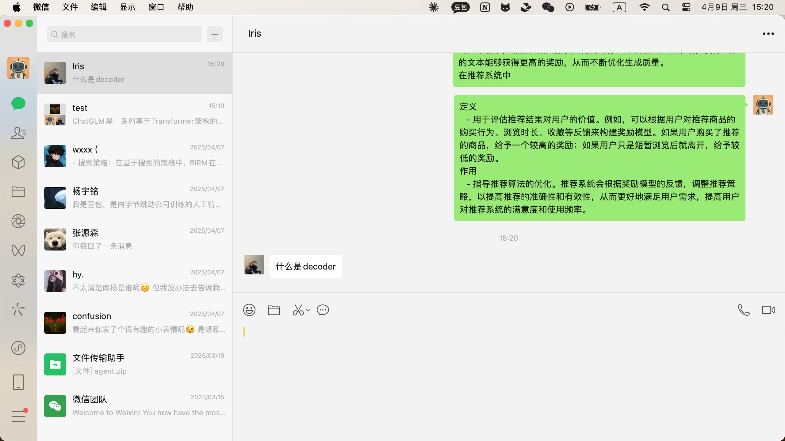
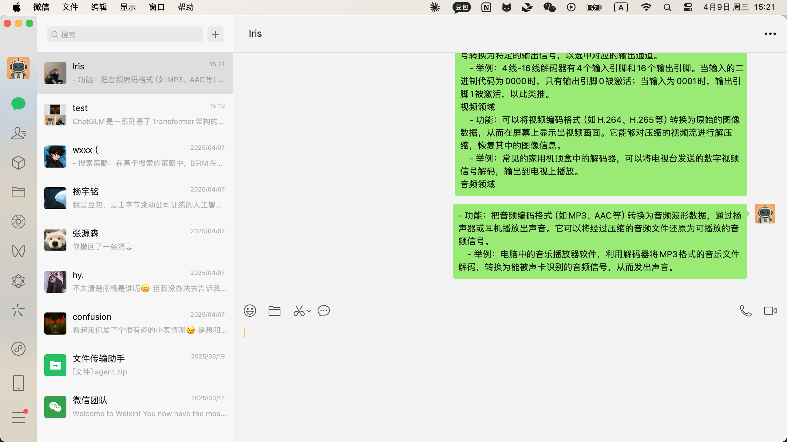
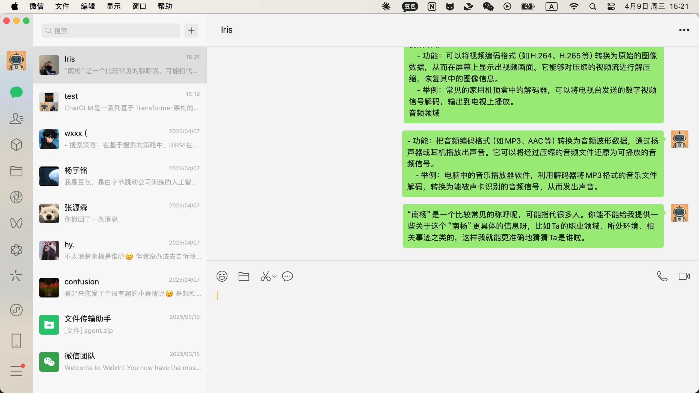
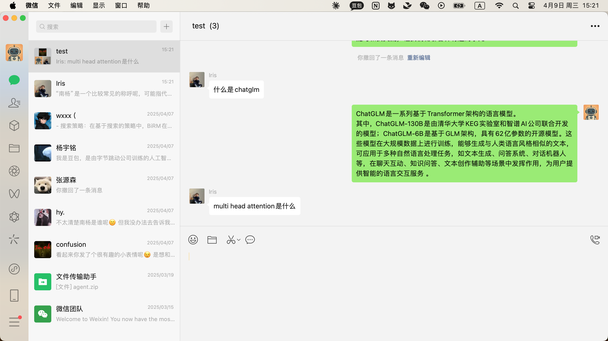
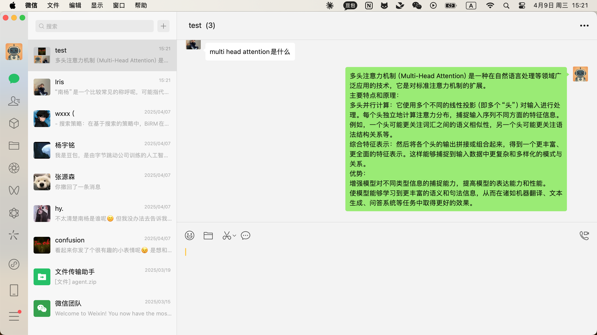

### 2025-04-09 15:21:00

**Screenshot:**

**Output:**
I get the high quality answer and I will send it.
Action: send text: Decoder即解码器，是一种将特定编码格式转换为其他格式或可理解信息的设备或程序。在不同领域，解码器有着不同的应用：
- **数字电路领域**
    - **功能**：是一种多输入多输出的组合逻辑电路，它能够将二进制编码信号转换为特定的输出信号，以选中对应的输出通道。
    - **举例**：4线-16线解码器有4个输入引脚和16个输出引脚。当输入的二进制代码为0000时，只有输出引脚0被激活；当输入为0001时，输出引脚1被激活，以此类推。
- **视频领域**
    - **功能**：可以将视频编码格式（如H.264、H.265等）转换为原始的图像数据，从而在屏幕上显示出视频画面。它能够对压缩的视频流进行解压缩，恢复其中的图像信息。
    - **举例**：常见的家用机顶盒中的解码器，可以将电视台发送的数字视频信号解码，输出到电视上播放。
- **音频领域**
    - **功能**：把音频编码格式（如MP3、AAC等）转换为音频波形数据，通过扬声器或耳机播放出声音。它可以将经过压缩的音频文件还原为可播放的音频信号。
    - **举例**：电脑中的音乐播放器软件，利用解码器将MP3格式的音乐文件解码，转换为能被声卡识别的音频信号，从而发出声音。 

### 2025-04-09 15:21:10

**Screenshot:**

**Output:**
I get the high quality answer and I will send it.
Action: send text: “南杨”是一个比较常见的称呼呢，可能指代很多人。你能不能给我提供一些关于这个“南杨”更具体的信息呀，比如Ta的职业领域、所处环境、相关事迹之类的，这样我就能更准确地猜猜Ta是谁啦。 

### 2025-04-09 15:21:15

**Screenshot:**

**Output:**
Thought: The user's message "不太清楚南杨是谁呢😊但我没办法去告诉你..." has already been processed and responded to. There are no new messages after the last green box that need further action.
Action: finish

### 2025-04-09 15:21:42

**Screenshot:**

**Output:**
I get the high quality answer and I will send it.
Action: send text: 多头注意力机制（Multi-Head Attention）是一种在自然语言处理等领域广泛应用的技术，它是对标准注意力机制的扩展。

**主要特点和原理**：
- **多头并行计算**：它使用多个不同的线性投影（即多个“头”）对输入进行处理。每个头独立地计算注意力分布，捕捉输入序列不同方面的特征信息。例如，一个头可能更关注词汇之间的语义相似性，另一个头可能更关注语法结构关系等。
- **综合特征表示**：然后将各个头的输出拼接或组合起来，得到一个更丰富、更全面的特征表示。这样能够捕捉到输入数据中更复杂和多样化的模式与关系。

**优势**：
- 增强模型对不同类型信息的捕捉能力，提高模型的表达能力和性能。
- 使模型能够学习到更丰富的语义和句法信息，从而在诸如机器翻译、文本生成、问答系统等任务中取得更好的效果。 

### 2025-04-09 15:21:47

**Screenshot:**

**Output:**
Thought: The task has been completed as the response to the user's query is already provided in the green box.
Action: finish

