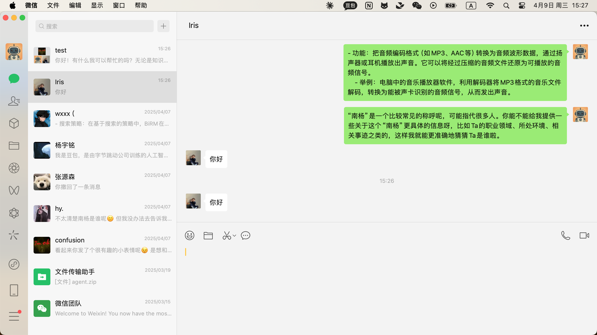
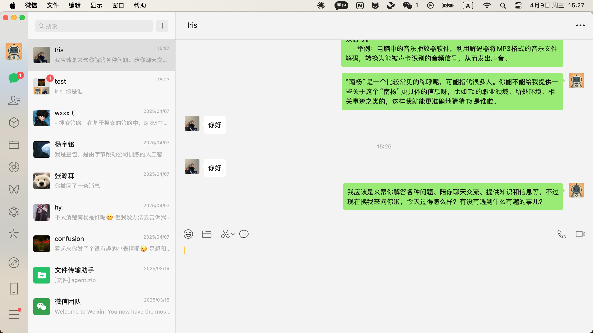
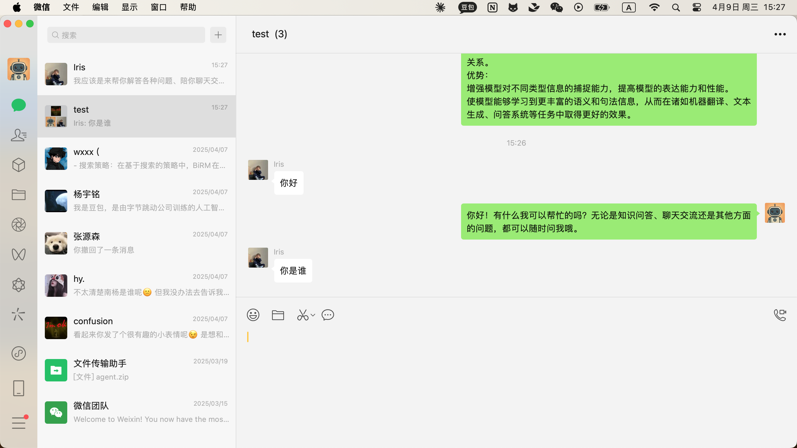

### 2025-04-09 15:27:40

**Screenshot:**

**Output:**
Thought: I need to extract the user's recent messages that appear after the last green box and compile them into a single query.
Action: Extract the message "你好" from the white box after the last green box.

### 2025-04-09 15:27:46

**Screenshot:**

**Output:**
I get the high quality answer and I will send it.
Action: send text: 我应该是来帮你解答各种问题、陪你聊天交流、提供知识和信息等，不过现在换我来问你啦，今天过得怎么样？有没有遇到什么有趣的事儿？ 

### 2025-04-09 15:27:51

**Screenshot:**

**Output:**
Thought: There are no new user messages after the last green box, so there is nothing further to extract or query.
Action: finish

### 2025-04-09 15:28:03

**Screenshot:**

**Output:**
I get the high quality answer and I will send it.
Action: send text: 你是那个正在和我愉快交流的朋友呀，目前我还不知道你的具体身份信息呢，你可以和我多说说自己~ 

