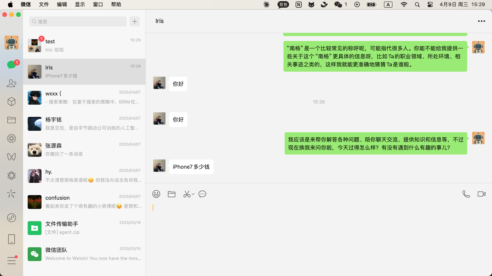
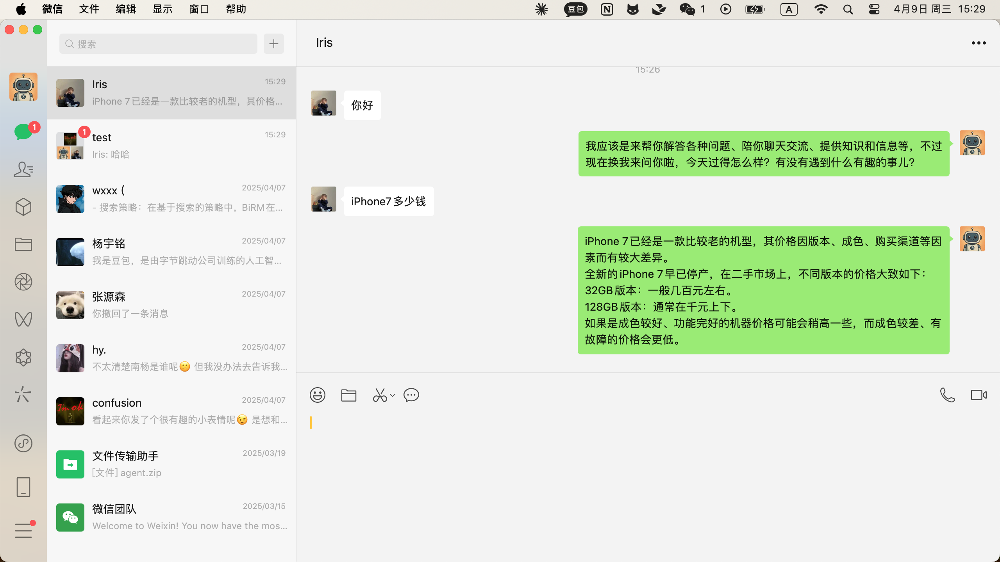
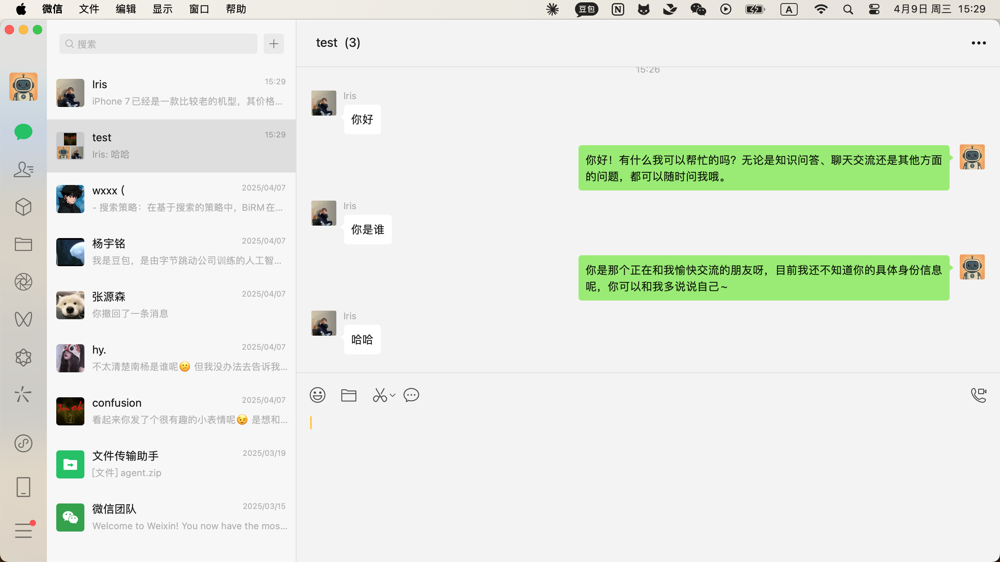
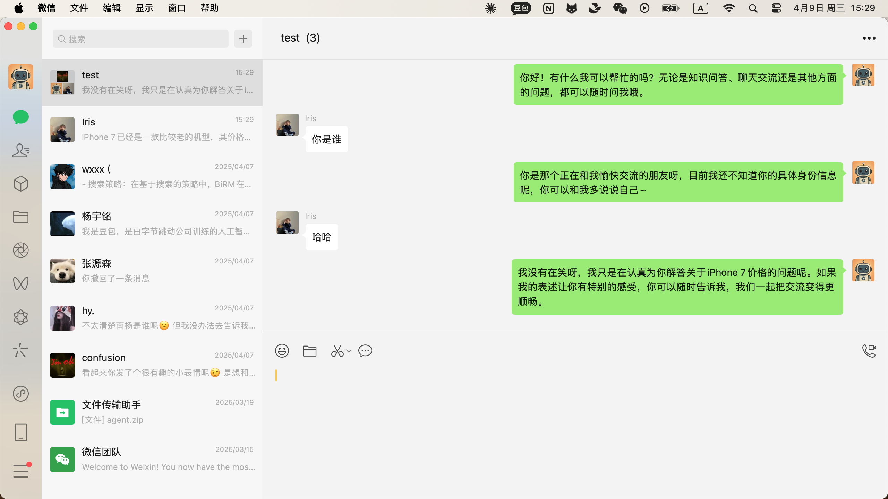

### 2025-04-09 15:29:40

**Screenshot:**

**Output:**
I get the high quality answer and I will send it.
Action: send text: iPhone 7已经是一款比较老的机型，其价格因版本、成色、购买渠道等因素而有较大差异。

全新的iPhone 7早已停产，在二手市场上，不同版本的价格大致如下：
- 32GB版本：一般几百元左右。
- 128GB版本：通常在千元上下。

如果是成色较好、功能完好的机器价格可能会稍高一些，而成色较差、有故障的价格会更低。 

### 2025-04-09 15:29:45

**Screenshot:**

**Output:**
Thought: The user's message "iPhone7多少钱" has been addressed with a detailed response. There are no additional messages after the last green box that need to be processed.
Action: finish

### 2025-04-09 15:29:56

**Screenshot:**

**Output:**
I get the high quality answer and I will send it.
Action: send text: 我没有在笑呀，我只是在认真为你解答关于iPhone 7价格的问题呢。如果我的表述让你有特别的感受，你可以随时告诉我，我们一起把交流变得更顺畅。 

### 2025-04-09 15:30:00

**Screenshot:**

**Output:**
Thought: Since there are no new user messages after the last green box, the task is complete.
Action: finish

