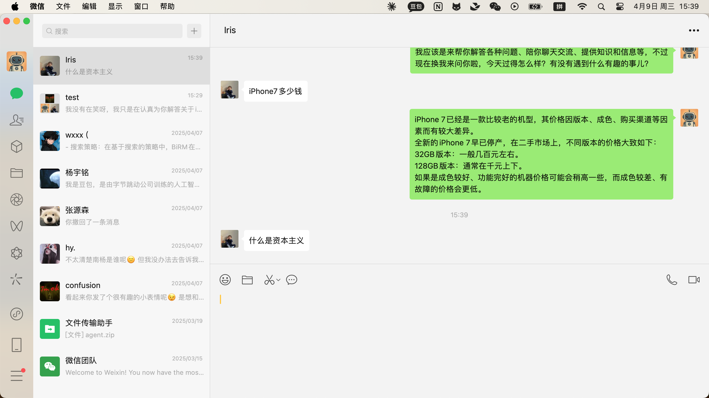

### 2025-04-09 15:39:14

**Screenshot:**

**Output:**
Thought: I need to extract the user's message "什么是资本主义" from the white box that appears after the last green box.
Action: Extract the user's message "什么是资本主义" for further processing.

### 2025-04-09 15:39:19

**Screenshot:**

**Output:**
Thought: I need to compile the extracted user message "什么是资本主义" into a single response and send it back.
Action: type text: content 什么是资本主义

