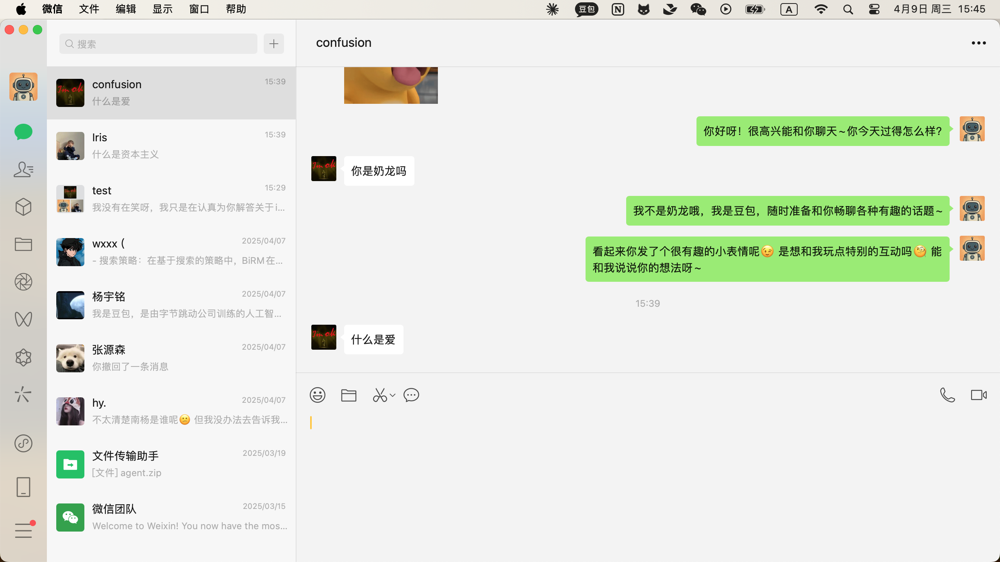

### 2025-04-09 15:45:33

**Screenshot:**

**Output:**
Thought: I need to extract the user's recent messages that appear after the last green box and compile them into a single query.
Action: Extract the message "什么是爱" from the white box and throw it as a query.

