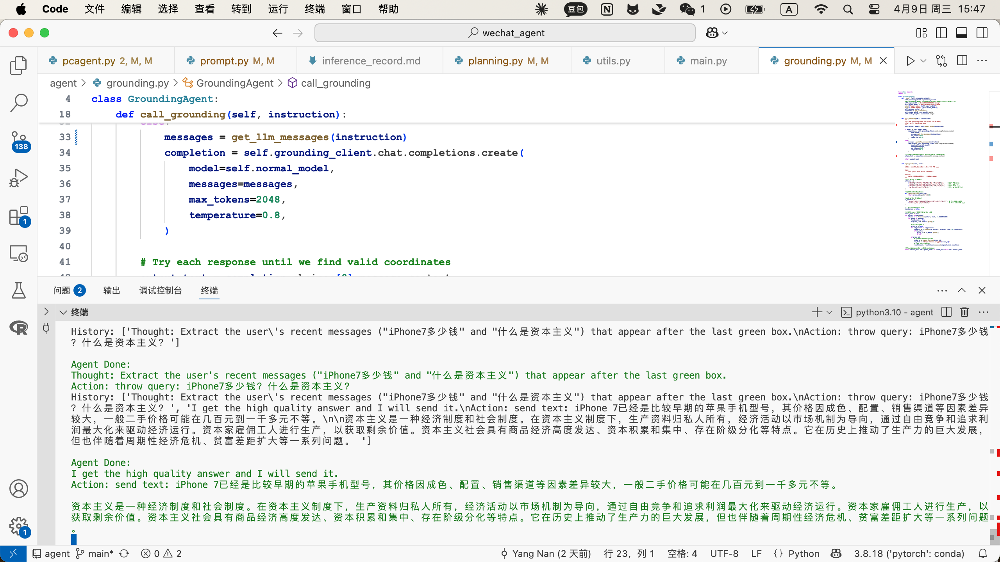

### 2025-04-09 15:47:50

**Screenshot:**

**Output:**
I get the high quality answer and I will send it.
Action: send text: iPhone 7已经是比较早期的苹果手机型号，其价格因成色、配置、销售渠道等因素差异较大，一般二手价格可能在几百元到一千多元不等。

资本主义是一种经济制度和社会制度。在资本主义制度下，生产资料归私人所有，经济活动以市场机制为导向，通过自由竞争和追求利润最大化来驱动经济运行。资本家雇佣工人进行生产，以获取剩余价值。资本主义社会具有商品经济高度发达、资本积累和集中、存在阶级分化等特点。它在历史上推动了生产力的巨大发展，但也伴随着周期性经济危机、贫富差距扩大等一系列问题。 

### 2025-04-09 15:47:55

**Screenshot:**

**Output:**
Thought: The task has been completed as the user's messages have been responded to with high-quality answers.
Action: finish

