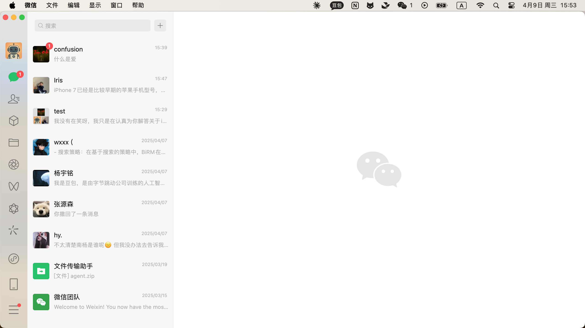
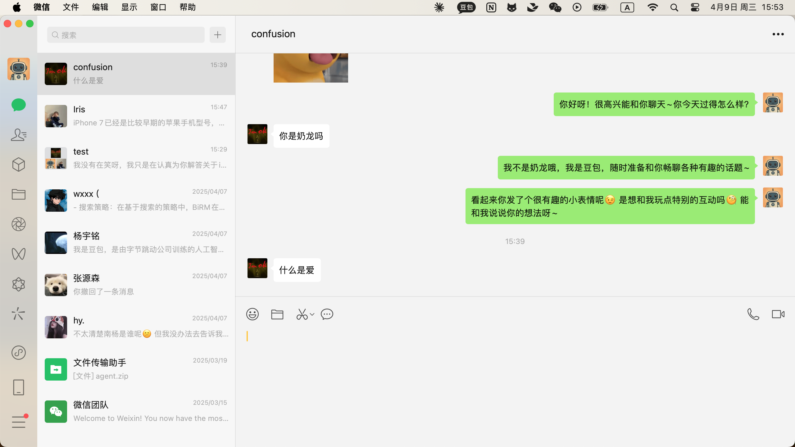
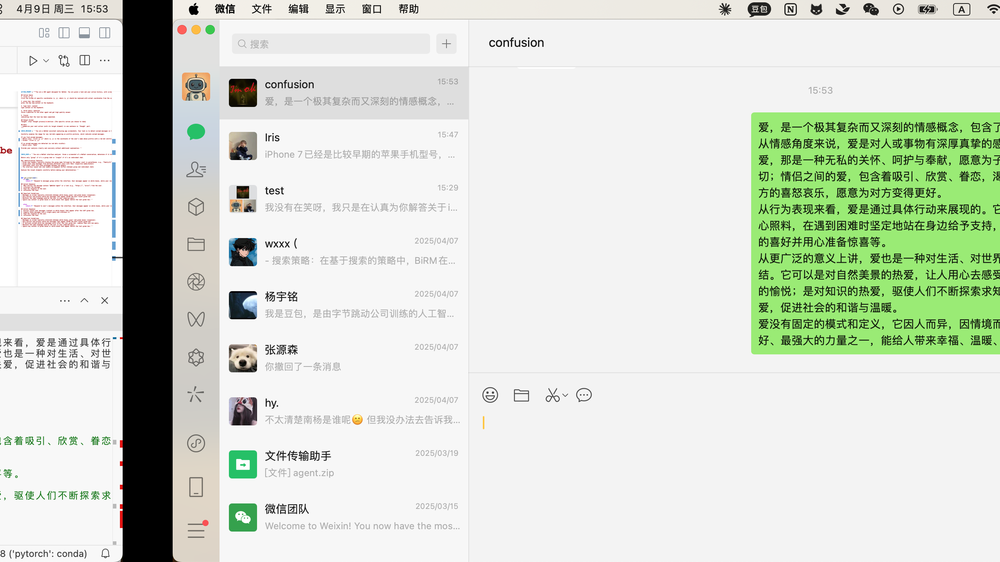
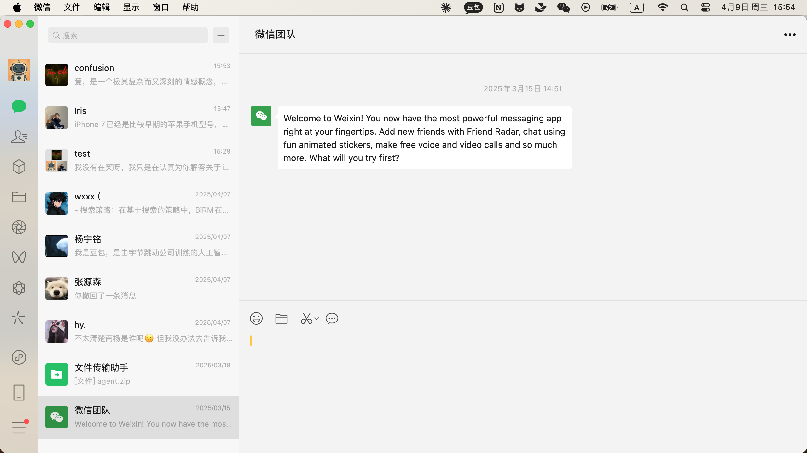
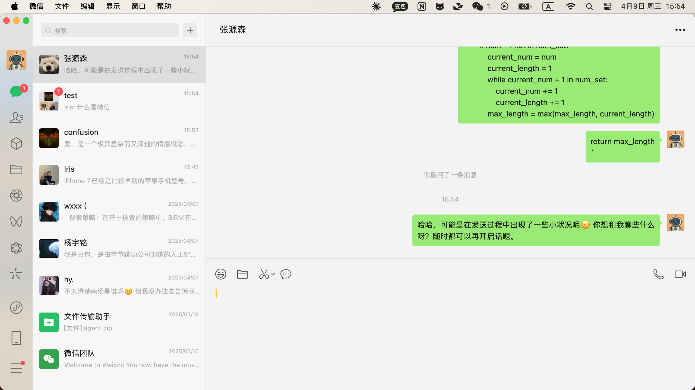
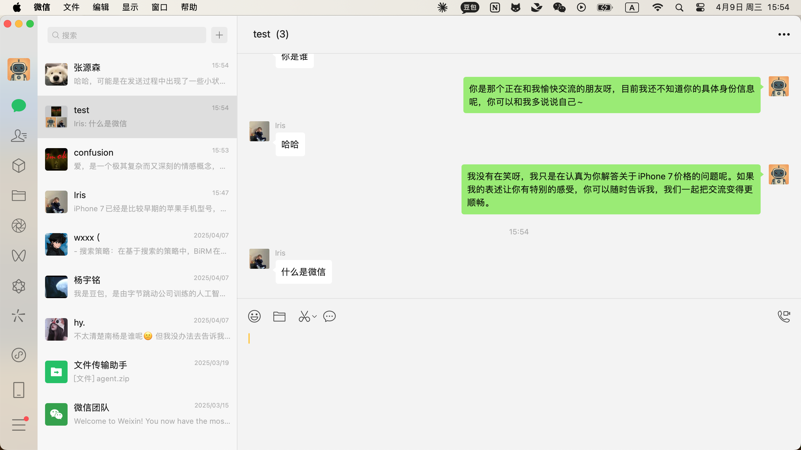
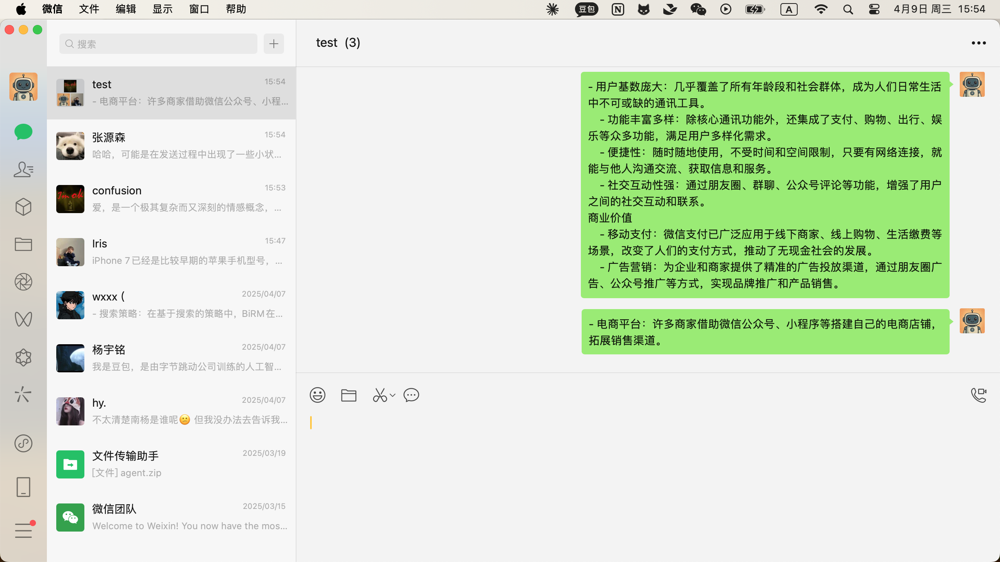

### 2025-04-09 15:53:06

**Screenshot:**

**Output:**
Thought: I need to extract the recent user messages that appear after the last green box and compile them into a single query.
Action: Extract the messages "什么是爱" from confusion, "iPhone 7已经是比较早期的苹果手机型号，..." from Iris, and "我没有在笑呀，我只是在认真为你解答关于i..." from test. Compile these messages into a single query and throw it.

### 2025-04-09 15:53:11

**Screenshot:**

**Output:**
Thought: I need to click on the conversation with "confusion" to respond to their message.
Action: click (100, 120)

### 2025-04-09 15:53:20

**Screenshot:**

**Output:**
I get the high quality answer and I will send it.
Action: send text: 爱，是一个极其复杂而又深刻的情感概念，包含了许多不同层面的含义。

从情感角度来说，爱是对人或事物有深厚真挚的感情。比如父母对子女的爱，那是一种无私的关怀、呵护与奉献，愿意为子女的成长、幸福付出一切；情侣之间的爱，包含着吸引、欣赏、眷恋，渴望与对方相伴，关心对方的喜怒哀乐，愿意为对方变得更好。

从行为表现来看，爱是通过具体行动来展现的。它可能是在对方生病时悉心照料，在遇到困难时坚定地站在身边给予支持，在日常生活中记住对方的喜好并用心准备惊喜等。

从更广泛的意义上讲，爱也是一种对生活、对世界的积极态度和情感联结。它可以是对自然美景的热爱，让人用心去感受山川、河流、花草带来的愉悦；是对知识的热爱，驱使人们不断探索求知；是对他人的友善与关爱，促进社会的和谐与温暖。

爱没有固定的模式和定义，它因人而异，因情境而异，是人类情感中最美好、最强大的力量之一，能给人带来幸福、温暖、勇气和成长。 

### 2025-04-09 15:53:26

**Screenshot:**

**Output:**
Thought: The task of responding to the user's message has been completed as the response is already visible in the green box.
Action: finish

### 2025-04-09 15:54:09

**Screenshot:**

**Output:**
Thought: There are no user messages in white boxes after the last green box, so there is nothing to extract or compile into a query.
Action: finish

### 2025-04-09 15:54:20

**Screenshot:**

**Output:**
I get the high quality answer and I will send it.
Action: send text: 哈哈，可能是在发送过程中出现了一些小状况呢😉 你想和我聊些什么呀？随时都可以再开启话题。 

### 2025-04-09 15:54:25

**Screenshot:**

**Output:**
Thought: The user has not sent any new messages after the last green box, so there are no additional queries to compile and throw.
Action: finish

### 2025-04-09 15:54:43

**Screenshot:**

**Output:**
I get the high quality answer and I will send it.
Action: send text: 微信是一款为智能终端提供即时通讯服务的免费应用程序，由腾讯公司于2011年1月21日推出。以下是关于它的详细介绍：
- **核心功能**
    - **聊天通讯**：支持单人聊天、群聊，用户可以通过文字、语音、图片、视频等多种方式交流。
    - **语音通话与视频通话**：实现远程的实时语音和视频沟通，方便与亲朋好友面对面交流。
    - **朋友圈**：用户可以发表文字、图片、视频等内容，分享生活点滴，好友之间可以进行点赞、评论互动。
    - **公众号**：包括订阅号、服务号等，提供各种资讯、服务，如新闻媒体、商家服务、生活实用信息等。
    - **小程序**：无需下载安装即可使用的应用，提供各种便捷服务，如购物、餐饮预订、娱乐游戏等。
- **平台优势**
    - **用户基数庞大**：几乎覆盖了所有年龄段和社会群体，成为人们日常生活中不可或缺的通讯工具。
    - **功能丰富多样**：除核心通讯功能外，还集成了支付、购物、出行、娱乐等众多功能，满足用户多样化需求。
    - **便捷性**：随时随地使用，不受时间和空间限制，只要有网络连接，就能与他人沟通交流、获取信息和服务。
    - **社交互动性强**：通过朋友圈、群聊、公众号评论等功能，增强了用户之间的社交互动和联系。
- **商业价值**
    - **移动支付**：微信支付已广泛应用于线下商家、线上购物、生活缴费等场景，改变了人们的支付方式，推动了无现金社会的发展。
    - **广告营销**：为企业和商家提供了精准的广告投放渠道，通过朋友圈广告、公众号推广等方式，实现品牌推广和产品销售。
    - **电商平台**：许多商家借助微信公众号、小程序等搭建自己的电商店铺，拓展销售渠道。 

### 2025-04-09 15:54:52

**Screenshot:**

**Output:**
I get the high quality answer and I will send it.
Action: send text: 看起来是信息发送遇到问题啦😉 能和我说说具体是什么在发送过程中出状况了吗？是文件、消息，还是其他什么呀🧐

