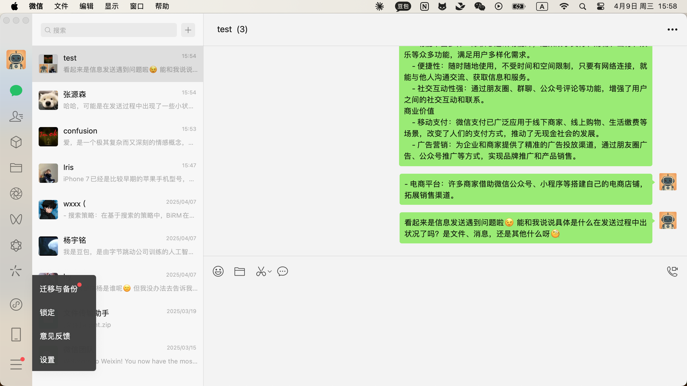
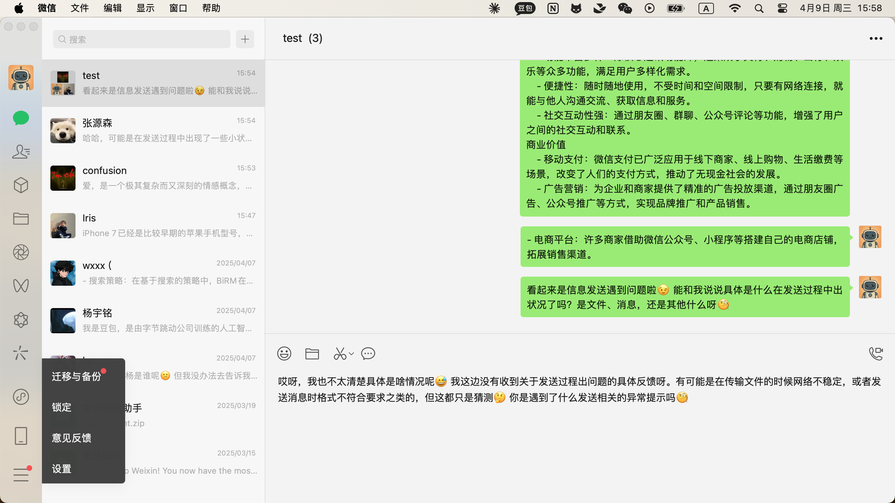

### 2025-04-09 15:58:49

**Screenshot:**

**Output:**
I get the high quality answer and I will send it.
Action: send text: 哎呀，我也不太清楚具体是啥情况呢😅 我这边没有收到关于发送过程出问题的具体反馈呀。有可能是在传输文件的时候网络不稳定，或者发送消息时格式不符合要求之类的，但这都只是猜测🤔 你是遇到了什么发送相关的异常提示吗🧐

### 2025-04-09 15:58:55

**Screenshot:**

**Output:**
Thought: The task has been completed as the response to the user's message has been sent.
Action: finish

