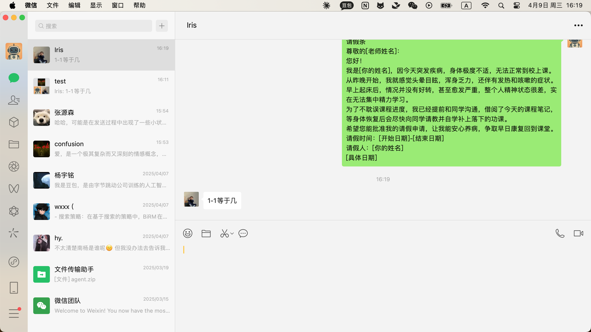
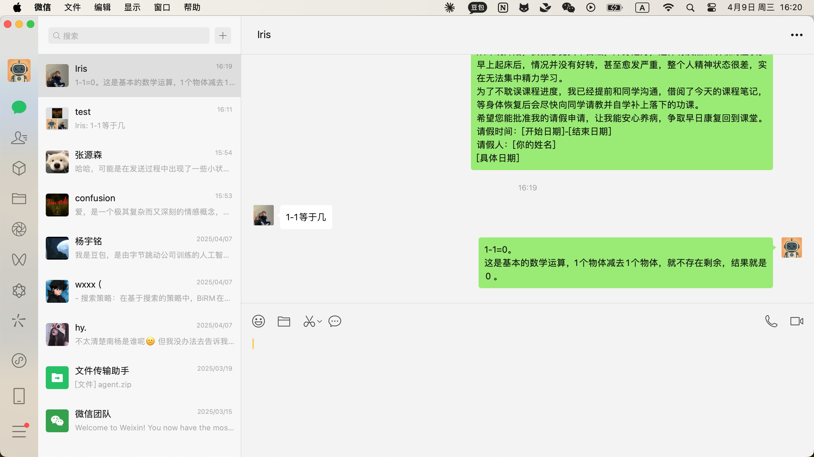
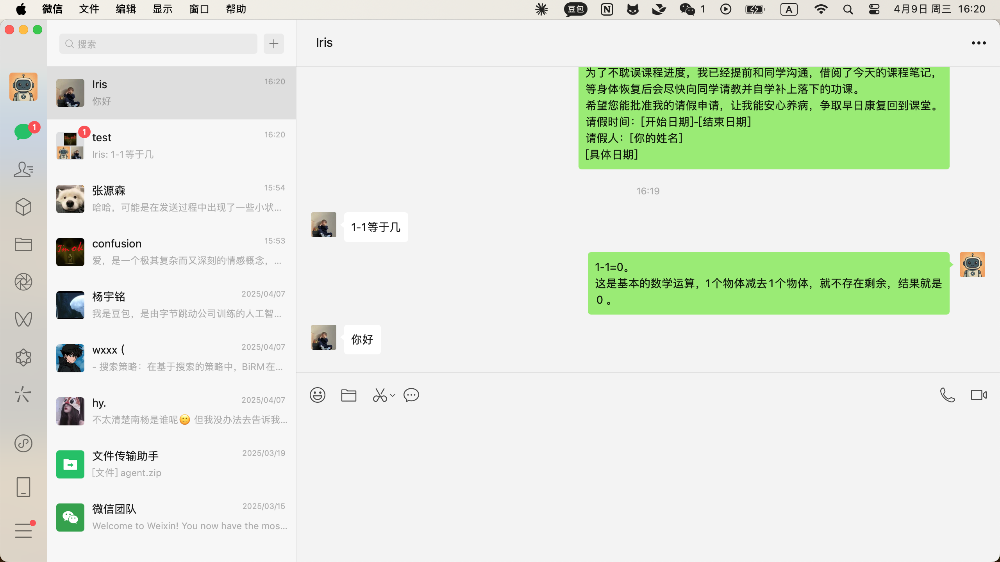
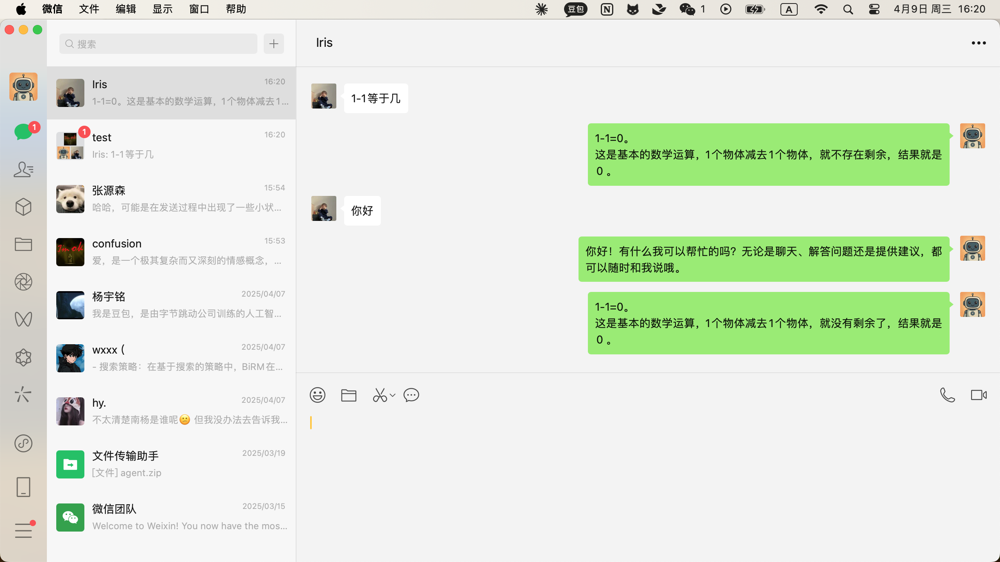
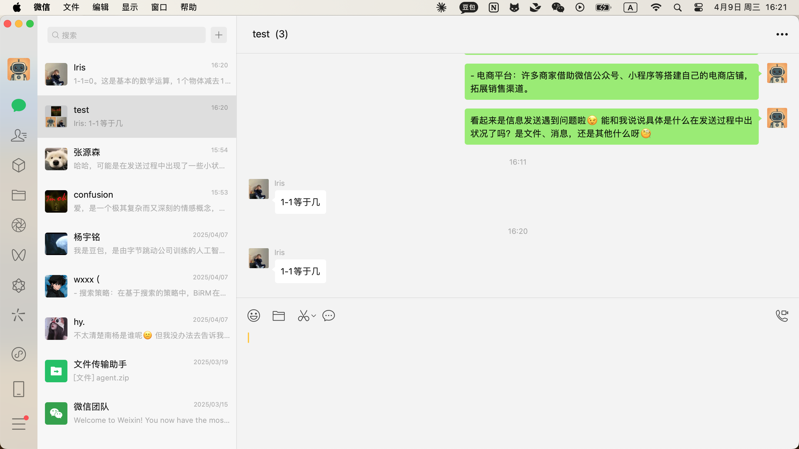
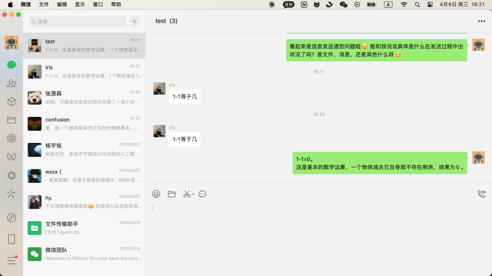
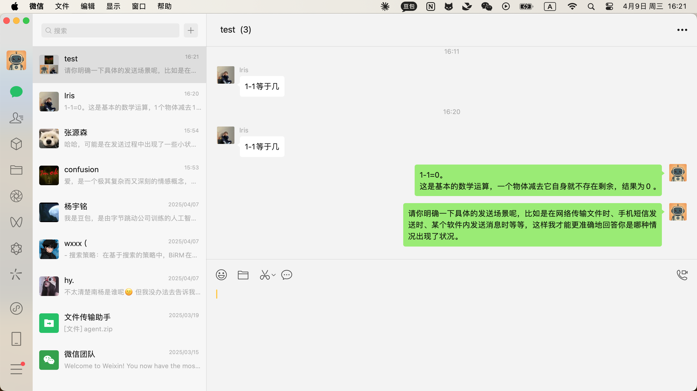

### 2025-04-09 16:19:57

**Screenshot:**

**Output:**
I get the high quality answer and I will send it.
Action: send text: 1-1=0。

这是基本的数学运算，1个物体减去1个物体，就不存在剩余，结果就是0 。 

### 2025-04-09 16:20:02

**Screenshot:**

**Output:**
Thought: There are no new user messages in white boxes after the last green box, so there is nothing further to respond to.
Action: finish

### 2025-04-09 16:20:31

**Screenshot:**

**Output:**
I get the high quality answer and I will send it.
Action: send text: 你好！有什么我可以帮忙的吗？无论是聊天、解答问题还是提供建议，都可以随时和我说哦。 

### 2025-04-09 16:20:37

**Screenshot:**

**Output:**
I get the high quality answer and I will send it.
Action: send text: 1-1=0。

这是基本的数学运算，1个物体减去1个物体，就没有剩余了，结果就是0 。 

### 2025-04-09 16:20:42

**Screenshot:**

**Output:**
Thought: There are no new user messages in white boxes after the last green box, so there is nothing further to respond to.
Action: finish

### 2025-04-09 16:21:42

**Screenshot:**

**Output:**
I get the high quality answer and I will send it.
Action: send text: 1-1=0。

这是基本的数学运算，一个物体减去它自身就不存在剩余，结果为0 。 

### 2025-04-09 16:21:52

**Screenshot:**

**Output:**
I get the high quality answer and I will send it.
Action: send text: 请你明确一下具体的发送场景呢，比如是在网络传输文件时、手机短信发送时、某个软件内发送消息时等等，这样我才能更准确地回答你是哪种情况出现了状况。 

### 2025-04-09 16:21:56

**Screenshot:**

**Output:**
Thought: The user's messages have been addressed, and the task requirements have been fulfilled as per the action sequence.
Action: finish

