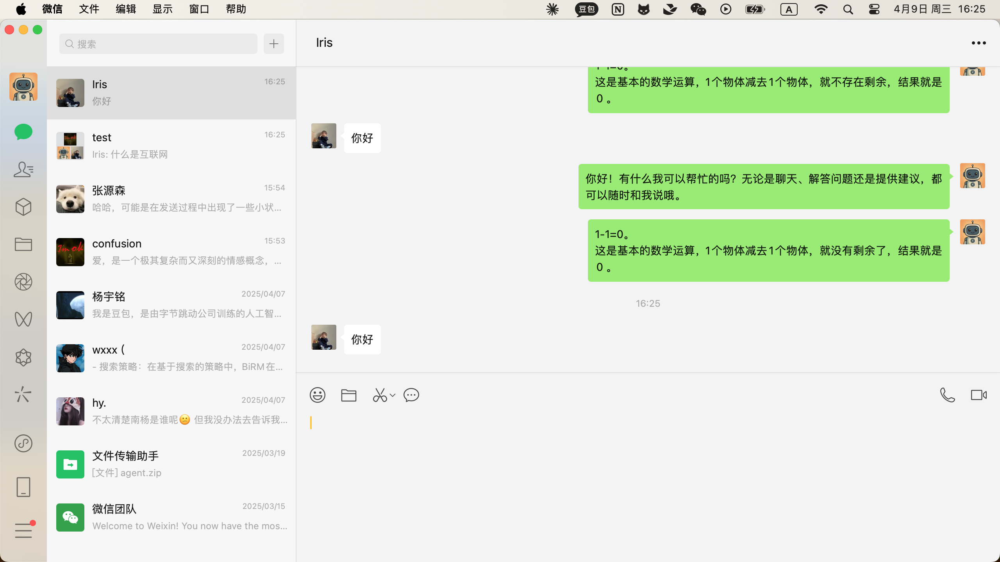
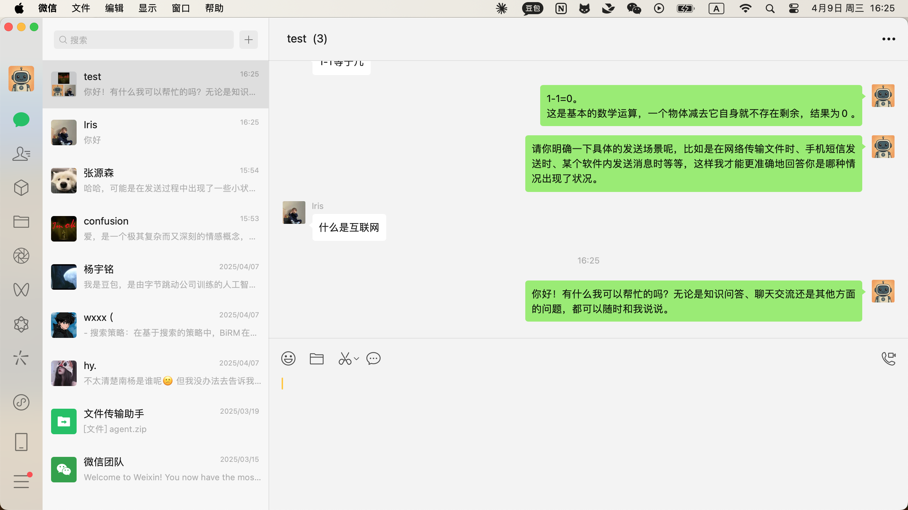
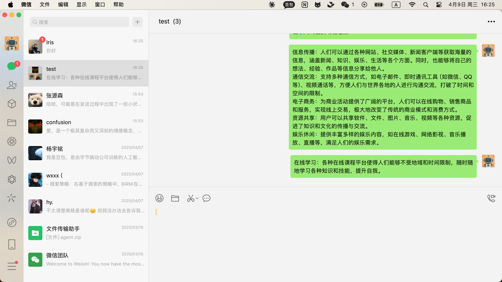
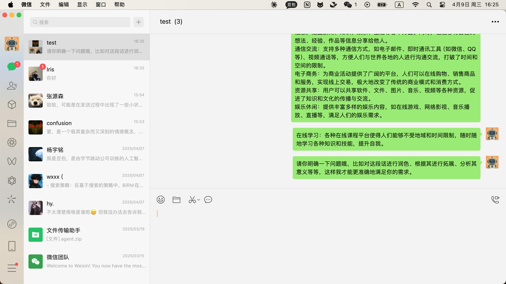

### 2025-04-09 16:25:25

**Screenshot:**

**Output:**
I get the high quality answer and I will send it.
Action: send text: 你好！有什么我可以帮忙的吗？无论是知识问答、聊天交流还是其他方面的问题，都可以随时和我说说。 

### 2025-04-09 16:25:40

**Screenshot:**

**Output:**
I get the high quality answer and I will send it.
Action: send text: 互联网是指将两台计算机或者是两台以上的计算机终端、客户端、服务端通过计算机信息技术的手段互相联系起来的结果，人们可以与远在千里之外的朋友相互发送邮件、共同完成一项工作、共同娱乐。

互联网始于1969年的美国，又称因特网。是网络与网络之间所串连成的庞大网络，这些网络以一组通用的协议相连，形成逻辑上的单一巨大国际网络。通常internet泛指互联网，而Internet则特指因特网。这种将计算机网络互相联接在一起的方法可称作“网络互联”，在这基础上发展出覆盖全世界的全球性互联网络称互联网，即是互相连接一起的网络结构。互联网并不等同万维网，万维网只是一建基于超文本相互链接而成的全球性系统，且是互联网所能提供的服务其中之一。

互联网的主要功能包括：
- **信息传播**：人们可以通过各种网站、社交媒体、新闻客户端等获取海量的信息，涵盖新闻、知识、娱乐、生活等各个方面。同时，也能够将自己的想法、经验、作品等信息分享给他人。
- **通信交流**：支持多种通信方式，如电子邮件、即时通讯工具（如微信、QQ等）、视频通话等，方便人们与世界各地的人进行沟通交流，打破了时间和空间的限制。
- **电子商务**：为商业活动提供了广阔的平台，人们可以在线购物、销售商品和服务，实现线上交易，极大地改变了传统的商业模式和消费方式。
- **资源共享**：用户可以共享软件、文件、图片、音乐、视频等各种资源，促进了知识和文化的传播与交流。
- **娱乐休闲**：提供丰富多样的娱乐内容，如在线游戏、网络影视、音乐播放、直播等，满足人们的娱乐需求。
- **在线学习**：各种在线课程平台使得人们能够不受地域和时间限制，随时随地学习各种知识和技能，提升自我。 

### 2025-04-09 16:25:51

**Screenshot:**

**Output:**
I get the high quality answer and I will send it.
Action: send text: 请你明确一下问题哦，比如对这段话进行润色、根据其进行拓展、分析其意义等等，这样我才能更准确地满足你的需求。 

### 2025-04-09 16:26:03

**Screenshot:**

**Output:**
I get the high quality answer and I will send it.
Action: send text: 好呀，请你提供一下相关内容，以便我按照要求明确问题并向你提问。 

