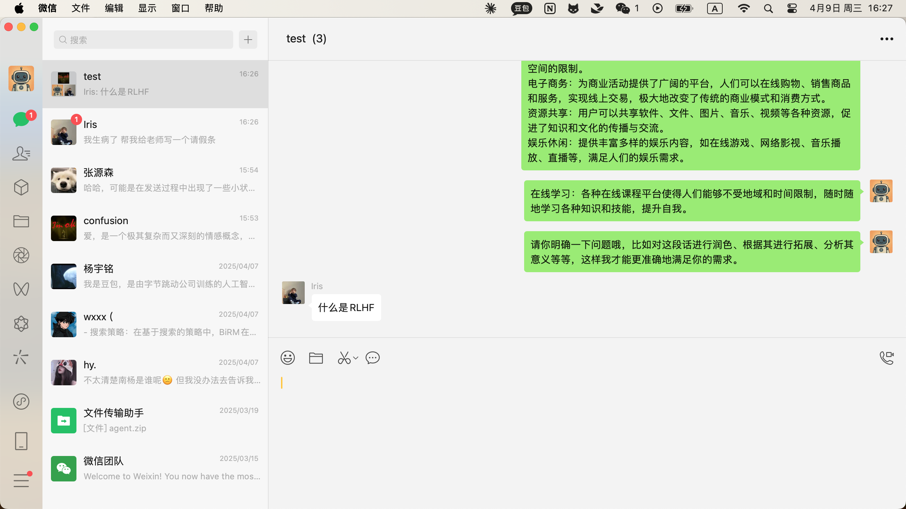
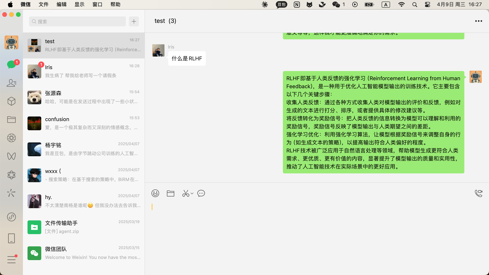
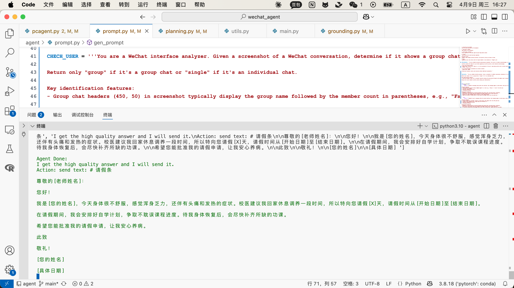

### 2025-04-09 16:27:25

**Screenshot:**

**Output:**
I get the high quality answer and I will send it.
Action: send text: RLHF即基于人类反馈的强化学习（Reinforcement Learning from Human Feedback），是一种用于优化人工智能模型输出的训练技术。它主要包含以下几个关键步骤：
1. **收集人类反馈**：通过各种方式收集人类对模型输出的评价和反馈，例如对生成的文本进行打分、排序，或者提供具体的修改建议等。
2. **将反馈转化为奖励信号**：把人类反馈的信息转换为模型可以理解和利用的奖励信号，奖励信号反映了模型输出与人类期望之间的差距。
3. **强化学习优化**：利用强化学习算法，让模型根据奖励信号来调整自身的行为（如生成文本的策略），以提高输出符合人类偏好的程度。

RLHF技术被广泛应用于自然语言处理等领域，帮助模型生成更符合人类需求、更优质、更有价值的内容，显著提升了模型输出的质量和实用性，推动了人工智能技术在实际场景中的更好应用。 

### 2025-04-09 16:27:37

**Screenshot:**

**Output:**
I get the high quality answer and I will send it.
Action: send text: # 请假条

尊敬的[老师姓名]：

您好！

我是[您的姓名]，今天身体很不舒服，感觉浑身乏力，还伴有头痛和发热的症状。校医建议我回家休息调养一段时间，所以特向您请假[X]天，请假时间从[开始日期]至[结束日期]。

在请假期间，我会安排好自学计划，争取不耽误课程进度。待我身体恢复后，会尽快补齐所缺的功课。

希望您能批准我的请假申请，让我安心养病。

此致

敬礼！

[您的姓名]

[具体日期] 

### 2025-04-09 16:27:42

**Screenshot:**

**Output:**
Thought: The user's message requesting a leave note has been addressed, and the response is already displayed in green. There are no additional unread white box messages after this response.
Action: finish

