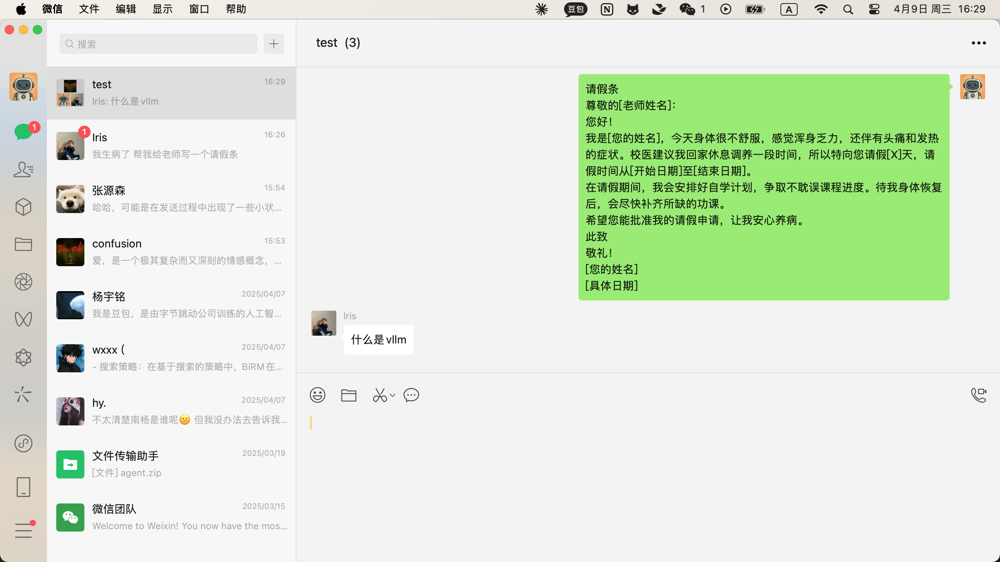
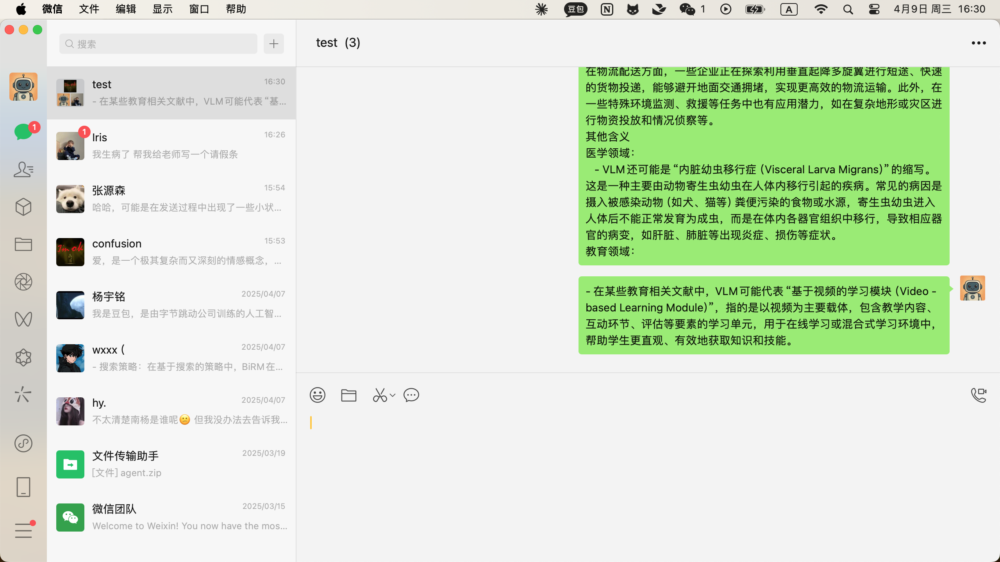
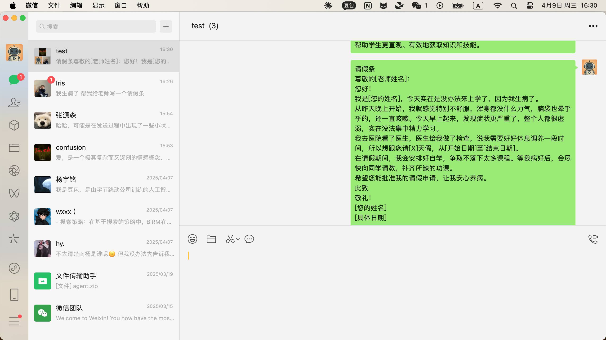

### 2025-04-09 16:30:33

**Screenshot:**

**Output:**
I get the high quality answer and I will send it.
Action: send text: VLM有多种含义，具体取决于上下文。以下是一些常见的解释：

### 1. 可变负载匹配（Variable Load Matching）
- **定义**：
   - 在电子工程、通信工程等领域，可变负载匹配是指通过调整电路参数，使负载与电源或信号源之间达到最佳的功率传输匹配状态。例如，在射频电路中，天线作为负载，其阻抗特性会随工作频率、环境等因素变化。通过采用诸如可变电容、可变电感或射频开关等元件组成的匹配网络，可以动态地调整负载阻抗，使其与信号源内阻实现共轭匹配，从而提高功率传输效率，减少反射损耗。
- **应用场景**：
   - 常用于无线通信设备中，如手机、基站等的射频前端电路。当手机在不同的信号环境下工作时，其天线的实际负载特性会发生变化。通过VLM技术，手机可以实时调整匹配网络，确保天线与射频收发信机之间保持良好的匹配，提高通信质量，增强信号强度和稳定性，减少信号反射导致的功率损耗和干扰。

### 2. 虚拟物流管理（Virtual Logistics Management）
- **定义**：
   - 虚拟物流管理是利用信息技术对物流系统进行模拟、优化和控制的一种管理模式。它借助计算机仿真、虚拟现实等技术，构建虚拟的物流场景和流程模型。通过对物流资源（如仓库、运输车辆、配送中心等）、物流活动（如货物存储、运输调度、订单处理等）进行数字化建模和分析，实现对物流运作的可视化、预测和优化决策。
- **应用场景**：
   - 在大型物流企业或电商物流配送体系中应用广泛。例如，在规划新的物流配送中心布局时，可以利用虚拟物流管理技术创建虚拟模型，模拟不同货物存储方式、分拣流程和运输路线安排下的物流运作情况。通过对模型的分析，提前发现潜在问题，如货物拥堵、配送效率低下等，并进行优化调整，从而在实际建设和运营前就提高物流系统的效率和效益，降低成本。

### 3. 垂直起降多旋翼（Vertical - Lift Multicopter）
- **定义**：
   - 垂直起降多旋翼是一种特殊的飞行器，它结合了垂直起降能力和多旋翼飞行特点。通常由多个旋翼组成，通过改变不同旋翼的转速来产生不同方向和大小的升力与推力，从而实现垂直起降、悬停以及灵活的空中飞行姿态调整。与传统直升机相比，垂直起降多旋翼结构相对简单，操控性较好，并且在一些特定场景下具有独特优势。
- **应用场景**：
   - 在航拍领域，垂直起降多旋翼可以方便地快速起飞和悬停在拍摄位置上方，获取稳定的空中拍摄画面，用于电影拍摄、地形测绘、农业监测等。在物流配送方面，一些企业正在探索利用垂直起降多旋翼进行短途、快速的货物投递，能够避开地面交通拥堵，实现更高效的物流运输。此外，在一些特殊环境监测、救援等任务中也有应用潜力，如在复杂地形或灾区进行物资投放和情况侦察等。

### 4. 其他含义
- **医学领域**：
   - VLM还可能是“内脏幼虫移行症（Visceral Larva Migrans）”的缩写。这是一种主要由动物寄生虫幼虫在人体内移行引起的疾病。常见的病因是摄入被感染动物（如犬、猫等）粪便污染的食物或水源，寄生虫幼虫进入人体后不能正常发育为成虫，而是在体内各器官组织中移行，导致相应器官的病变，如肝脏、肺脏等出现炎症、损伤等症状。
- **教育领域**：
   - 在某些教育相关文献中，VLM可能代表“基于视频的学习模块（Video - based Learning Module）”，指的是以视频为主要载体，包含教学内容、互动环节、评估等要素的学习单元，用于在线学习或混合式学习环境中，帮助学生更直观、有效地获取知识和技能。 

### 2025-04-09 16:30:46

**Screenshot:**

**Output:**
I get the high quality answer and I will send it.
Action: send text: # 请假条

尊敬的[老师姓名]：

您好！

我是[您的姓名]，今天实在是没办法来上学了，因为我生病了。

从昨天晚上开始，我就感觉特别不舒服，浑身都没什么力气，脑袋也晕乎乎的，还一直咳嗽。今天早上起来，发现症状更严重了，整个人都很虚弱，实在没法集中精力学习。

我去医院看了医生，医生给我做了检查，说我需要好好休息调养一段时间，所以想跟您请[X]天假，从[开始日期]至[结束日期]。

在请假期间，我会安排好自学，争取不落下太多课程。等我病好后，会尽快向同学请教，补齐所缺的功课。

希望您能批准我的请假申请，让我安心养病。

此致

敬礼！

[您的姓名]

[具体日期] 

### 2025-04-09 16:30:54

**Screenshot:**

**Output:**
I get the high quality answer and I will send it.
Action: send text: 看起来是信息在传递途中出问题啦😉 能和我说说具体是什么在发送时出状况了吗？这样我们好一起想想办法~ 

